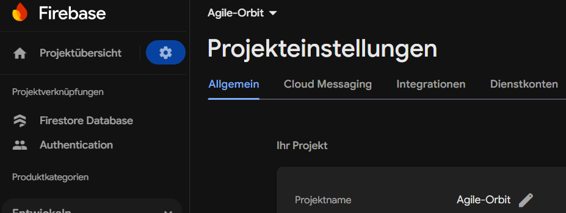
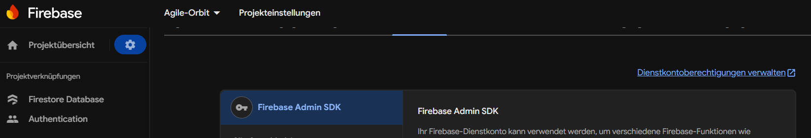
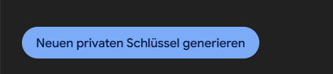

# AgileOrbit

FH Project for SoftwareEngineering - AgileOrbit is a tool to help developers keep track of tasks and documents. It can evolve in the future to hold more responsibilities and features to help coordinate and cooperate with the team itself.

## 🚀 Getting Started

### Prerequisites
- Node.js (v16 or later)
- npm (v8 or later)
- Git

## 📦 Installation

1. **Clone the repository**
   ```bash
   git clone https://github.com/CoOkieDragOnJuliaS/agileOrbit
   cd agileorbit
   ```

## 🔧 Backend Setup
In root folder:
1. Install dependencies:
   ```bash
   npm install
   ```

2. Create a `.env` file in the root directory with:
   ```env
   PORT=5000
   HOST=localhost
   HOST_URL=http://localhost:5000
   API_KEY=your-api-key
   AUTH_DOMAIN=your-auth-domain
   PROJECT_ID=project-id
   ADMIN_EMAIL=your-service-account-email@project.iam.gserviceaccount.com
   DATABASE_URL=project-url
   STORAGE_BUCKET=your-storage-bucket
   MESSAGING_SENDER_ID=your-messaging-sender-id
   APP_ID=your-app-id
   MEASUREMENT_ID=your-measurement-id
   ```
The data is located here (in the settings menu of the firebase project overview):
- 

- The ADMIN-email is located in the Admin Settings --> see Firebase Admin SDK Setup below


4. Start the backend server:
   ```bash
   npm run dev
   ```

## 💻 Frontend Setup

1. In a new terminal, navigate to the client directory:
   ```bash
   cd client
   ```

2. Install dependencies:
   ```bash
   npm install
   ```

3. Create a `.env` file in the client directory:
   ```env
   REACT_APP_FIREBASE_API_KEY=your-api-key
   REACT_APP_FIREBASE_AUTH_DOMAIN=agile-orbit-d6365.firebaseapp.com
   REACT_APP_FIREBASE_PROJECT_ID=agile-orbit-d6365
   REACT_APP_FIREBASE_STORAGE_BUCKET=agile-orbit-d6365.appspot.com
   REACT_APP_FIREBASE_MESSAGING_SENDER_ID=539662100374
   REACT_APP_FIREBASE_APP_ID=1:539662100374:web:e685e1504f103a824c5fb7
   REACT_APP_FIREBASE_MEASUREMENT_ID=G-XYB10Z21VS
   REACT_APP_API_URL=http://localhost:3001
   ```

4. Start the development server (inside the root directory):
   ```bash
   npm run client
   ```

## 🔑 Firebase Admin SDK Setup (One-time)

1. Go to [Firebase Console](https://console.firebase.google.com/)
2. Select your project
3. Click the gear icon ⚙️ > Project settings
4. Go to "Service accounts" tab
5. Click "Generate new private key"
6. Save the JSON file securely with the new name: serviceAccountKey.json
7. Copy the private key and client email to your local root's `.env` file

- Information about the "Dienstkonto", the admin:
- 
-  (Generate a new key, save it and copy it into the root folder of your local project - with the name: serviceAccountKey.json)

## 🛠 Available Scripts

### Frontend (from /client)
- `npm start` - Start development server
- `npm test` - Run tests
- `npm run build` - Create production build

### Backend (from /server)
- `npm start` - Start server in production mode
- `npm run dev` - Start server in development mode with nodemon


## 🔍 Troubleshooting

### Common Issues
- **Firebase Authentication Errors**: Verify your Firebase configuration values
- **CORS Issues**: Ensure backend CORS is properly configured
- **Environment Variables Not Loading**: Restart your development server after changing `.env` files
- **Network Request Failed**: Check for typos in Firebase config and ensure all services are enabled
- **Unversioning a file you don't want to commit**: git rm --cached <filename>

## 📝 Notes
- Never commit `.env` files to version control
- Never commit serviceAccountKey.json to version control
- Keep your Firebase Admin credentials secure
- The project uses a monorepo structure with separate client and server directories
